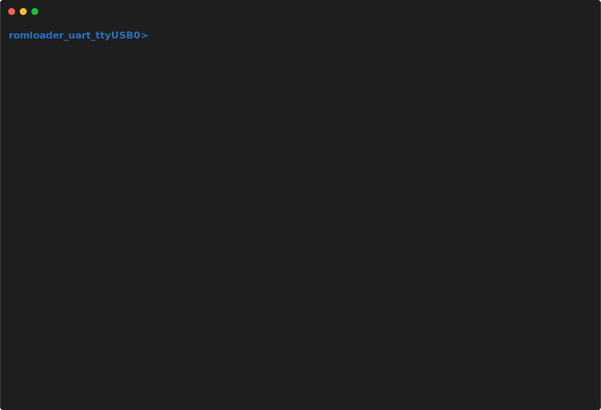
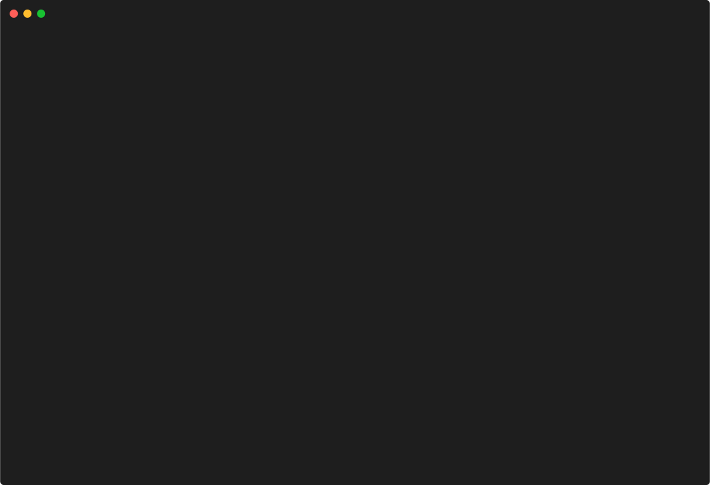
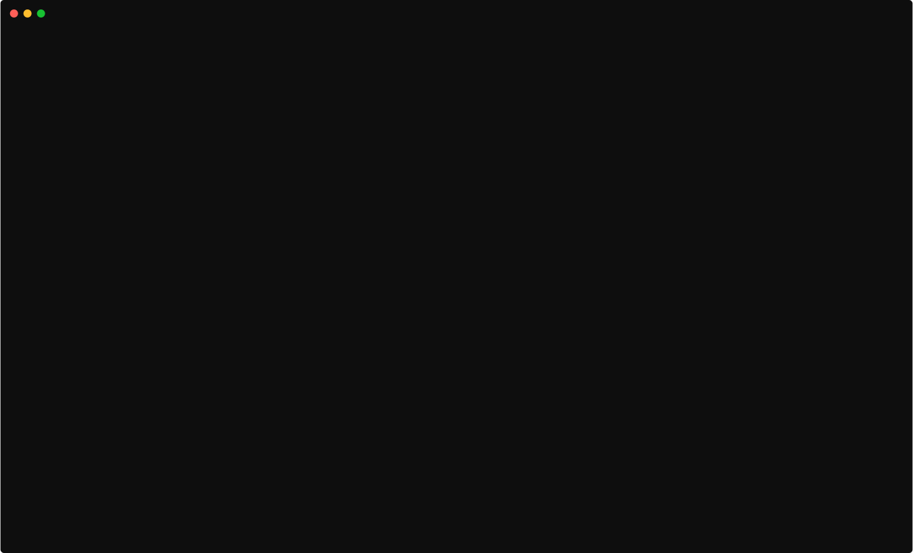

# Implementation-of-svg

# **Examples**

<!--  -->
<!--  -->
## **getting started:**
<!-- > getting started -->
<!-- right,left -->

 

## **write, verify, hash and read data:**
<!-- > write, verify, read and hash data -->
<!-- right,left -->

 

## **erase and iserase:**

 

## **input command:**

 

## **list command:**

 

<!-- > Example generated with `svg-term --cast 113643 --out examples/parrot.svg --window --no-cursor --from=4500` -->

<!-- > Share terminal sessions as razor-sharp animated SVG everywhere

  

> Example generated with `svg-term --cast 113643 --out examples/parrot.svg --window --no-cursor --from=4500` -->

<!-- 

 

 -->

<!--  -->  

<!--  -->