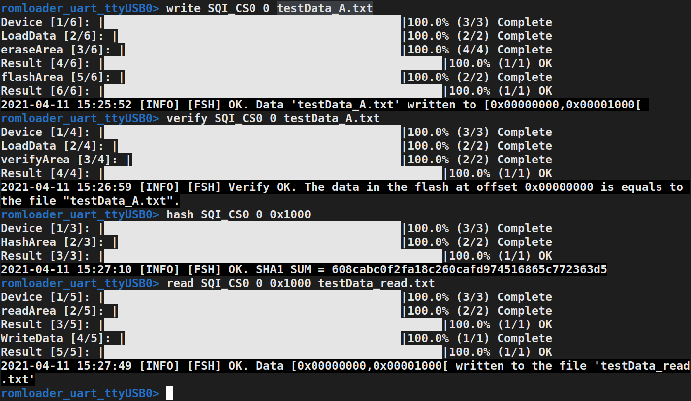
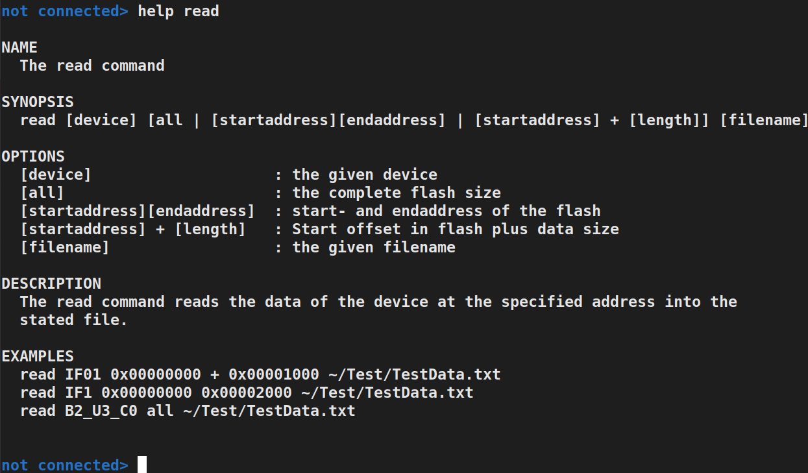
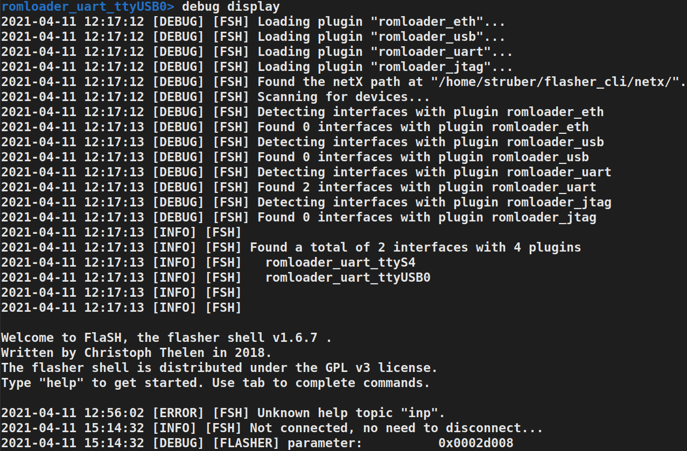
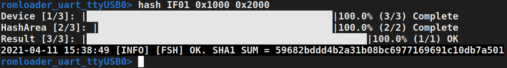

# Release Notes 1.6.8
{:toc}
## - Adding Progress Bar Information
{:toc}
The respective commands now show their progress through progress bar information.

  

## - Expanding the Help Command - New Design
{:toc}

  

## - New Feature: Input Command
{:toc}
The input command reads a file with commands (one command per line) and executes them after the commands have been validated. An example of the input command can be seen in the following: 

## - New Feature: List Command
{:toc}
The list command activates the list mode and supports the creation and editing of a list of commands. Numerous auxiliary commands are available within this mode. The following clip shows an example of the list command:

## - New Feature: Debug Command 
{:toc}
The debug command enables debug information to be displayed or saved.

  

## - Hash Command:  Expanded for Internal Flash
{:toc}

  

## - Adding Documentation (LDOC) of fsh.lua, progressbar.lua and flasher.lua 
{:toc}
The documentation of the modules can be found [here](https://muhkuh-sys.github.io//org.muhkuh.tools-flasher_pt/index_LDOC.html).

## - Improvement of Minor Bugs
{:toc}